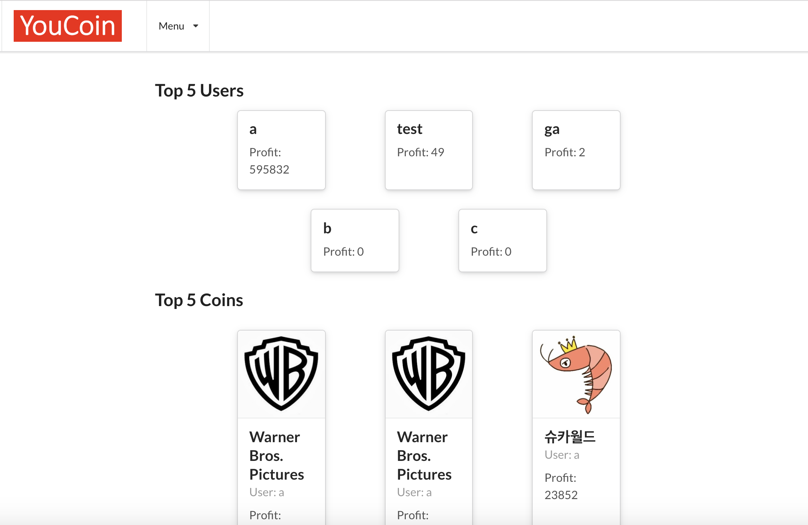

# YouCoin
> Applying values to our YouTube experience

## Table of contents
* [General info](#general-info)
* [Screenshots](#screenshots)
* [Technologies](#technologies)
* [Setup](#setup)
* [Features](#features)
* [Status](#status)
* [Inspiration](#inspiration)
* [Contact](#contact)

## General info
The act of subscribing in YouTube carries important meanings to users. By subscribing specific YouTubers, users feel like they are supporting them which they take pride of. When the YouTuber becomes more and more influencial after you become the fan of him/her, users feel they have insights.

YouCoin records the changes in the number of subscribers of the YouTuber after the use subscribes to him/her. YouCoin aims to activate YouTube fandom culture even more by helping users to validate their insights and choices.

## Screenshots

### Main


### Wallet


## Technologies
* JavaScript
* React
* Python
* Flask
* HTML5
* CSS3
* Semantic UI React
* SQLite
* API

## Setup
Link to the Website: [YouCoin](#https://youcoin-react.herokuapp.com/)

Link to the Backend : [YouCoing Flask Backend] (#https://github.com/benoh0906/youcoin_flask_backend)

To locally install YouCoin, please download sourcescode for the backend.

For the Backend, you must use your own API at 


## Code Examples

Creating coins by using API fetch call:

```
    create = async (coinInfo)=>{
      try {
        coinInfo["user"]=JSON.parse(localStorage.getItem("user")).id
        const loginResponse = await fetch(`${process.env.REACT_APP_BACKEND_URL}/api/v1/`, {
          method: 'POST',
          credentials: 'include',
          body: JSON.stringify(coinInfo),
          headers: {
            'Content-Type': 'application/json'
          }
        })
  
        const parsedResponse = await loginResponse.json();
  
        this.setState(() => {
          return {
            ...parsedResponse.data,
            loading: false
          }
        })
  
        return parsedResponse
    
      } catch (err) {
        console.log(err)
      }
    }
    
```

Basic React structure:

```

              <Header_logout userInfo={this.state} logout={this.logout}/>
              <Container text style={{ marginTop: '7em' }}>
                <Switch>

                  <Route exact path="/" render = {(props)=> <Main {...props} userInfo={this.state} /> }/>
                  <Route exact path="/login" render={(props) => <Login {...props} logIn={this.logIn} />} />
                  <Route exact path="/register" render={(props) => <Register {...props} register={this.register} /> } />
                  <Route exact path="/profile" render={(props) =>  <Profile {...props} userInfo={this.state}/> } />
                  <Route exact path="/create" render={(props) =>  <CoinContainer {...props} userInfo={this.state} /> } />
                  <Route exact path="/wallet" render={(props) =>  <Wallet {...props}   userInfo={this.state} /> } />
                  <Route exact path="/show" render={(props) =>  <Show {...props} userInfo={this.state} /> } />
                  <Route exact path="/editUser" render={(props) =>  <EditUser {...props} editUser={this.editUser} userInfo={this.state} /> } />
                  <Route exact path="/updatePassword" render={(props) =>  <UpdatePassword {...props} logout={this.logout} updatePassword={this.updatePassword} userInfo={this.state} /> } />

                  <Route component={My404} />        
                </Switch>
              </Container>
              
```

## Features
List of features ready and TODOs for future development

* Create, edit, and delete a user account
* Buy/Sell Coin assisted by YouTube API
* Coin/User Ranking 

To-do list:

* Statistics and graphs of coin values
* Re-design of the website UI

## Status
Project is: _in progress_

## Inspiration
Project inspired by YouTube.

## Contact
[GitHub](https://https://github.com/benoh0906/) 

[LinkedIn](https://www.linkedin.com/in/jungbinoh/)

