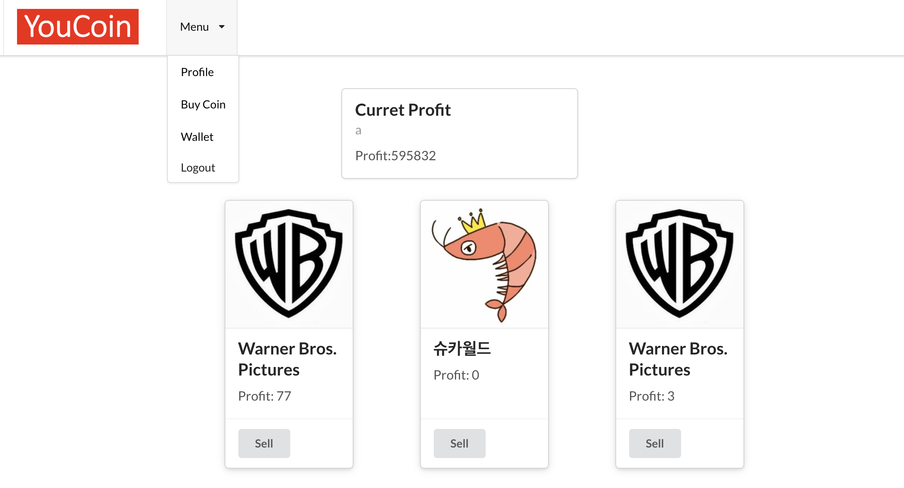

# YouCoin
> Applying values to our YouTube experience

## Table of contents
* [General info](#general-info)
* [Screenshots](#screenshots)
* [Technologies](#technologies)
* [Setup](#setup)
* [Features](#features)
* [Status](#status)
* [Inspiration](#inspiration)
* [Contact](#contact)

## General info
The act of subscribing in YouTube carries important meanings to users. By subscribing specific YouTubers, users feel like they are supporting them which they take pride of. When the YouTuber becomes more and more influencial after you become the fan of him/her, users feel they have insights.

YouCoin records the changes in the number of subscribers of the YouTuber after the use subscribes to him/her. YouCoin aims to activate YouTube fandom culture even more by helping users to validate their insights and choices.

## Screenshots

## Technologies
* JavaScript
* React
* Python
* Flask
* HTML5
* CSS3
* Semantic UI React
* API

## Setup
Link to App:[YouCoin](#https://youcoin-react.herokuapp.com/)

## Code Examples
Show examples of usage:
`put-your-code-here`

## Features
List of features ready and TODOs for future development

* Awesome feature 1
* Awesome feature 2
* Awesome feature 3

To-do list:

* Wow improvement to be done 1
* Wow improvement to be done 2

## Status
Project is: _in progress_, _finished_, _no longer continue_ and why?

## Inspiration
Add here credits. Project inspired by..., based on...

## Contact
Created by [@flynerdpl](https://www.flynerd.pl/) - feel free to contact me!